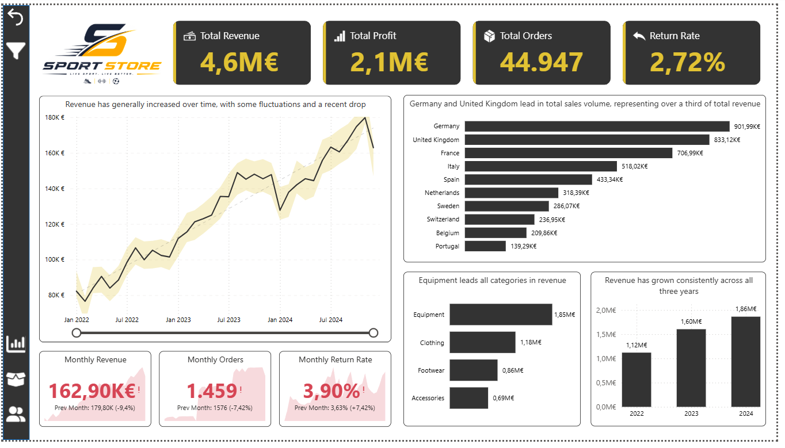
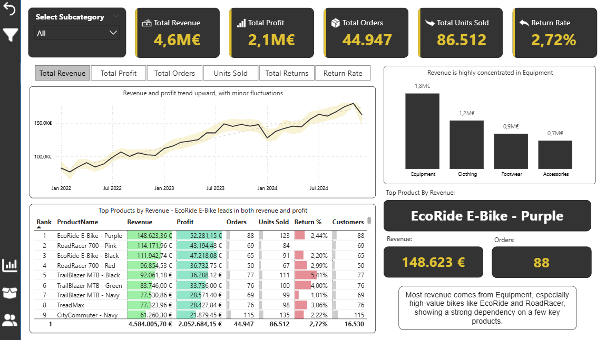
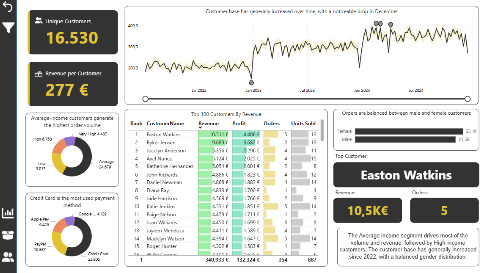

# 📊 Sales Analysis — Sport Store

## 🚀 Executive Summary
This analysis reveals three key insights:

- Most revenue comes from the Equipment category, especially from products like the EcoRide E-Bike and RoadRacer 700  
- Revenue and customer base have grown from 2022 to 2024  
- The business has a strong margin (~46%) and a low return rate (2.72%)  

👉 Overall, the business is growing and well managed, but depends a lot on a small number of high-value products.

## 📌 Project Overview
This project looks at sales, products, and customer performance for a sports retail store between 2022 and 2024.

The goal was to build an end-to-end analytics solution, from data transformation in SQL to the creation of an interactive Power BI dashboard, focused on business insights.

## 🎯 Business Objectives
- Analyze revenue and profit trends over time  
- Identify top-performing products and categories  
- Understand customer segments and purchasing behavior  
- Monitor key metrics:
  - Revenue  
  - Profit  
  - Orders  
  - Units sold  
  - Return rate  

## 🛠️ Tools & Technologies
- SQL Server → data cleaning, transformation, and modeling  
- Power BI → data visualization and dashboard development  

## 🧠 Data Preparation (SQL)
A dedicated **Analytics** schema was created on top of the raw data (**Store**) to separate operational data from analytics-ready data.

### Key steps:
- Cleaned and standardized customer data (name, gender, marital status, etc.)  
- Translated coded values (e.g., M → Married, Y → Yes)  
- Calculated derived metrics such as Product Profit (Price − Cost)  
- Combined yearly sales tables (2022–2024) into a single view:  
  `Vw_Fact_Sales` with a `Sales_Year` column  
- Added time attributes:
  - Year  
  - Quarter  
  - Month  
  - Month Name  

👉 Result: a structured dataset ready for analysis in Power BI.

## 📊 Dashboard

### Overview
- Key KPIs: Revenue, Profit, Orders, Return Rate  
- Revenue trend over time  
- Orders by product category  
- Top products with return rate indicators  
- Monthly KPIs with comparison to previous month  

### Product Analysis
- Top products by revenue, profit, and units sold  
- Revenue distribution by category  
- Product performance trends over time  
- Highlight card for top-performing product  

### Customer Analysis
- Unique customers and revenue per customer  
- Customer growth over time (with a noticeable drop in December)  
- Top 100 customers by revenue  
- Orders by income segment  
- Payment methods  
- Gender distribution  

## 📸 Dashboard Preview

### Overview

### Product Analysis

### Customer Analysis

## 💡 Key Insights

📈 Revenue has grown from 2022 to 2024, reaching €4.6M, showing strong business growth  

🚴 The Equipment category generates most of the revenue, driven by high-value products like bikes  

🎯 A small number of products generate a large share of revenue, showing dependency on key items  

👥 The Average income segment generates most of the customer volume and revenue, followed by High-income customers  

💳 Credit Card is the most used payment method, followed by PayPal  

🔁 The overall return rate is low (2.72%), although some products like Leggings have higher return levels  

## ⚠️ Limitations
- Dataset is simulated (synthetic data)  
- Does not include external factors (marketing, promotions, seasonality)  
- Return data does not include reasons  

## 🚀 Next Steps
- Implement customer segmentation (RFM analysis)  
- Analyze profitability and margins per product  
- Explore geographic performance  
- Build revenue forecasting models  

## 📂 Project Structure

    Dataset/
    SQL_Analysis/
    Power_BI/
    ├── SportStore_Sales_Analysis.pbix
    └── Images/
    Docs/
    README.md

## 👤 Author
Project developed by João, focused on end-to-end data analysis and data-driven decision making.
